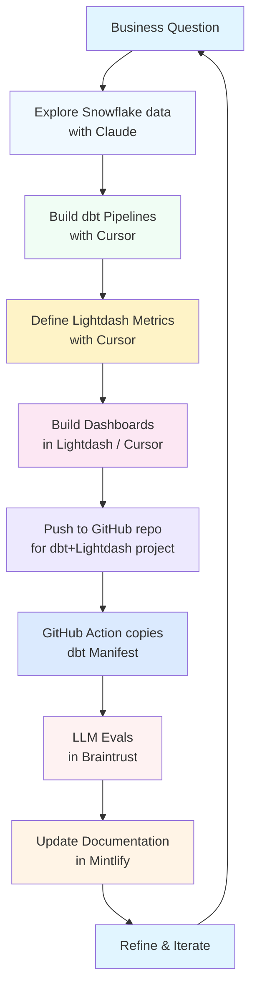

This workflow enables rapid development of dbt models, metrics, and dashboards using AI assistance.

## The Development Cycle: From Question to Data Product



**The Development Cycle:**

1. **Explore Snowflake data with Claude**: Use Claude.ai or Cursor with Snowflake MCP to query and understand raw data
2. **Build dbt Pipelines with Cursor**: Write dbt models in Cursor (staging → modeling → gold layers)
3. **Define Lightdash Metrics with Cursor**: Create semantic layer and metrics in Lightdash YAML files
4. **Build Dashboards in Lightdash / Cursor**: Design visualizations in Lightdash UI or define them as code in Cursor
5. **Push to GitHub repo**: Commit dbt models and Lightdash configurations to version control
6. **GitHub Action copies dbt Manifest**: GitHub Actions automatically publish the dbt manifest for Prime to serve
7. **LLM Evals in Braintrust**: Braintrust runs evaluations to ensure AI query accuracy against your data
8. **Update Documentation in Mintlify**: Document your data models, metrics, and dashboards in MDX files based on evaluation results
9. **Refine & Iterate**: Based on feedback and new requirements, cycle back to improve

## Prerequisites

*   Cursor IDE installed with Prime and Snowflake MCP servers configured
*   Access to the dbt repository
*   Snowflake credentials configured
*   Lightdash CLI installed and authenticated

See the [Developer Setup Guide](/analytics-stack/getting-started/developer) for detailed installation instructions.

## Building dbt Models with AI

### 1. Explore & Plan

Use **Cursor's Chat** to understand the data.
*   Ask generic questions about the codebase (Prime provides context).
*   Sample data using the Snowflake MCP to verify assumptions.

### 2. Build dbt Models

Leverage Cursor to write SQL and YAML.
*   **Generate SQL**: Describe the transformation you need. Cursor uses your dbt context to suggest correct table references and join logic.
*   **Auto-document**: specific columns or tables using AI generation, adhering to our naming conventions (e.g., `UPPERCASE_UNDERSCORED`).

### 3. Test & Validate

*   Run `dbt run` and `dbt test` within the Cursor terminal.
*   Use the **Snowflake MCP** to run ad-hoc checks on the created tables to ensure data quality (e.g., `SELECT * FROM new_model LIMIT 10`).

## Building the Lightdash Semantic Layer

Lightdash metrics are defined directly in your dbt model YAML files using the `meta` tag. This creates a semantic layer that business users can query through Lightdash **as well as via AI assistants**

**Add metrics to columns:**

```yaml
models:
  - name: orders
    columns:
      - name: user_id
        meta:
          metrics:
            count_users:
              type: count_distinct
              label: "Total Users"
              description: "Unique count of users who placed orders"
      - name: revenue
        meta:
          metrics:
            total_revenue:
              type: sum
              format: '[$£]#,##0.00'
```

**Add model-level metrics:**

For metrics that reference multiple columns or other metrics:

```yaml
models:
  - name: orders
    meta:
      metrics:
        revenue_per_user:
          type: number
          sql: ${total_revenue} / ${count_users}
          label: "Revenue per User"
```

**Key metric types:**

- **Aggregate metrics**: `sum`, `count`, `count_distinct`, `average`, `min`, `max`
- **Non-aggregate metrics**: `number`, `string`, `boolean` (reference other metrics only)
- **Post-calculation metrics**: `percent_of_previous`, `percent_of_total`, `running_total`

<Note>
For a complete reference on metrics, dimensions, and advanced configurations, see the [Lightdash Metrics documentation](https://docs.lightdash.com/references/metrics).
</Note>

## Lightdash CLI Workflows

The Lightdash CLI enables powerful workflows for developing and managing your charts and dashboards. Here are the key commands you'll use:

| Command | Description |
|---------|-------------|
| `lightdash generate` | Compiles your dbt models and generates Lightdash metadata locally. Useful for validating your dbt model configurations before deploying. |
| `lightdash deploy` | Deploys your local Lightdash configuration (charts, dashboards, and dbt models) to your Lightdash project. Typically run in CI/CD pipelines. |
| `lightdash download` | Downloads charts and dashboards from your Lightdash project as YAML files to your local repository. Enables version control for visualizations. |
| `lightdash upload` | Uploads locally defined charts and dashboards (YAML files) to your Lightdash project. Use this to push local changes to the cloud. |
| `lightdash start-preview` | Creates a temporary preview project for testing changes before deploying to production. |
| `lightdash stop-preview` | Cleans up and removes the temporary preview project. |

<Tip>
For a complete reference of all available commands and options, see the [Lightdash CLI documentation](https://docs.lightdash.com/references/lightdash-cli).
</Tip>

## Deploy

*   Commit changes to version control.
*   CI/CD pipelines handle the production deployment.

