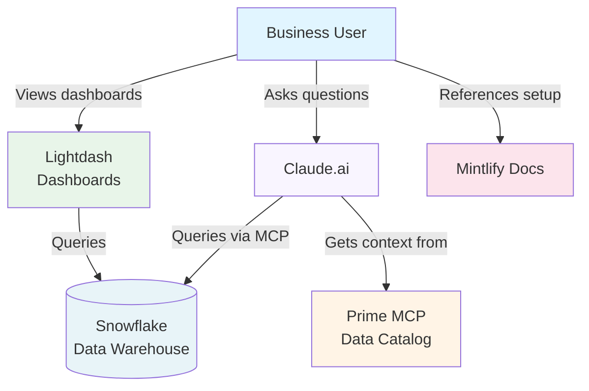

As a business user, you'll set up Claude.ai to query Snowflake data and understand your dbt semantic layer, plus gain access to Lightdash for dashboard exploration.

## How the Systems Connect



**What each system does:**
- **Snowflake**: Your data warehouse where all business data is stored
- **Claude.ai**: AI assistant that queries data via the Snowflake MCP connector and uses Prime for semantic context
- **Prime MCP**: Data catalog that provides Claude with information about your dbt models, metrics, and lineage
- **Lightdash**: Dashboard platform for exploring pre-built visualizations and creating custom charts
- **Mintlify**: Documentation hub for setup guides and reference materials

## Prerequisites

- Snowflake account with MCP role access
- Claude.ai account (Pro recommended)
- Lightdash access credentials

## 1. Request Access from Your Admin

Contact your Snowflake administrator to:
- Grant you the `MCP` role in Snowflake
- Provide Snowflake MCP connection details (URL, Client ID, Client Secret)
- Provide Prime MCP server URL
- Grant you access to Lightdash

## 2. Configure Snowflake MCP in Claude

### 2.1 Open Claude Settings

1. Go to [Claude.ai](https://claude.ai)
2. Navigate to **Settings** > **Connectors** > **Add custom connector**
3. Name it "Snowflake"

### 2.2 Enter Connection Details

Enter the connection details provided by your admin:
- **Remote URL**: `https://zh06779.north-europe.azure.snowflakecomputing.com/api/v2/databases/MCP/schemas/PUBLIC/mcp-servers/SEARCHLIGHT`
- **Client ID**: Provided by admin
- **Client Secret**: Provided by admin

### 2.3 Authenticate

1. When your browser redirects to the authentication screen, **replace the `ROLE=ALL` parameter with `ROLE=MCP`** in the URL. I.e. replace **&scope=session%3Arole%3Aall** with **&scope=session%3Arole%3AMCP**
2. Complete the authentication flow
3. When prompted, ensure you select the **MCP role**

### 2.4 Verify Connection

1. Start a new chat in Claude
2. You should see "Snowflake" as an available connector under the options button
3. Ask: *"Show me a list of the databases in Snowflake"*
4. Claude should query Snowflake and return results

### Troubleshooting

- **Permissions Error**: Ask your admin to verify: `SHOW GRANTS ON MCP SERVER MCP.PUBLIC.SEARCHLIGHT` shows your role has usage
- **Still Stuck?**: Miles spent a lot of time getting this working. Ask him for help!

## 3. Configure Prime MCP in Claude

### 3.1 Add Prime Connector

1. In Claude.ai, navigate to **Settings** > **Connectors** > **Add custom connector**
2. Name it "Prime"
3. Enter the Prime URL provided by your admin (e.g., `http://prime-f15k.onrender.com/`)
4. No OAuth configuration needed at this stage

### 3.2 Verify Connection

Ask Claude: *"Using Prime, tell me which metrics exist in our warehouse"*

Claude should now understand your dbt semantic layer, including:
- Table schemas and column descriptions
- Metric definitions
- Lineage relationships between models

## 4. Configure Claude Personal Preferences

Optimize Claude's behavior for data analysis by adding a personal preference that instructs it to be more transparent about calculations and assumptions.

1. In Claude.ai, go to **Settings** > **General** > **Custom instructions**
2. Add the following personal preference:

```
When building analysis with SQL, explain in natural language the calculation logic you used and any risky assumptions you have made.
```

## 5. Access Lightdash

1. Navigate to your organization's Lightdash URL (provided by admin)
2. Sign in using your credentials
3. Explore available dashboards and data models

Lightdash provides:
- Pre-built dashboards for key business metrics
- Self-service exploration of your data models
- Integration with your dbt semantic layer

## 6. Test Your Setup

Now that everything is configured, test your access:

**In Claude:**
- Ask about your data: *"What tables are in the FIBER_MAP database?"*
- Query using metrics: *"Using Prime, what is the definition of our revenue metric?"*
- Perform analysis: *"Show me the top 10 customers by revenue this quarter"*

**In Lightdash:**
- Open a dashboard and explore filters
- Try creating a custom saved chart
- Export data for further analysis

## Next Steps

<CardGroup cols={2}>
  <Card
    title="Business User Workflow"
    icon="diagram-project"
    href="/analytics-stack/business-user-workflow"
  >
    Learn how to use these tools effectively for daily analysis
  </Card>
  <Card
    title="FAQ"
    icon="circle-question"
    href="/analytics-stack/faq"
  >
    Common questions and troubleshooting
  </Card>
</CardGroup>
