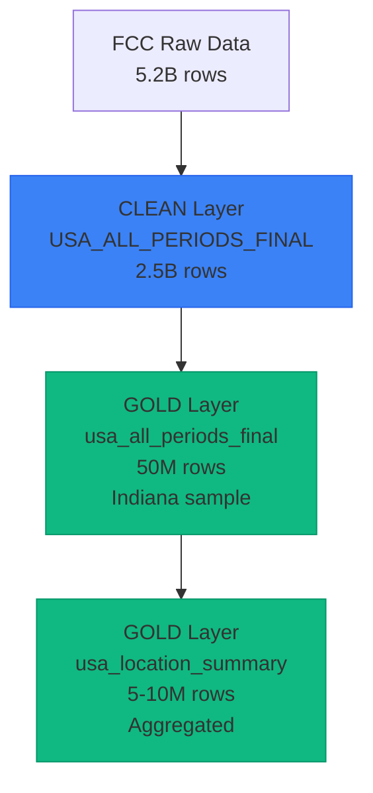

## Overview

The Clean layer contains raw, unprocessed data from the FCC broadband reporting program. This is the source of truth for all downstream tables, but most analysts won't need to query these tables directly.

**Database**: `FIBER_MAP`  
**Schema**: `CLEAN`

<Warning>
**Performance Note**: Clean layer tables contain billions of rows. Most business users should work with the Gold layer tables instead, which are optimized for analysis and filtered to relevant geographies.
</Warning>

---

## USA_ALL_PERIODS_FINAL

**Fully Qualified Name**: `FIBER_MAP.CLEAN.USA_ALL_PERIODS_FINAL`

**Description**: Full US broadband availability dataset from FCC reporting, covering all states and time periods. This is the staging layer that feeds all downstream transformations.

**Row Count**: ~2.5 billion records

**Geographic Coverage**: All 50 US states plus territories

**Time Coverage**: June 2022 through December 2024 (semi-annual updates)

### Purpose

This table serves as the:
- **Source of truth** for broadband availability data
- **Input** for Gold layer transformations
- **Reference** for data validation and auditing

### When to Use

<AccordionGroup>
  <Accordion title="When you need national-level analysis" icon="globe">
    The Clean layer contains data for all states, not just Indiana. If you need to analyze multiple states or the entire US, query this table.
    
    **Note**: Be mindful of performance. Queries may be slow due to the large data volume. Use appropriate filters.
  </Accordion>
  
  <Accordion title="When you need the complete, unfiltered dataset" icon="filter-circle-xmark">
    The Gold layer contains a 2% sample filtered to Indiana. If you need 100% coverage or a different geography, use the Clean layer.
  </Accordion>
  
  <Accordion title="When you're validating data lineage" icon="code-branch">
    Trace data back to its source to understand transformations and validate calculations.
  </Accordion>
</AccordionGroup>

### Schema

The Clean layer table includes these primary fields:

| Field Name | Type | Description |
|------------|------|-------------|
| LOCATION_ID | Number | Unique location identifier |
| STATE | String | State name (all 50 states) |
| COUNTY | String | County name |
| ZCTA | String | ZIP Code Tabulation Area |
| BLOCK_GEOID | String | Census block identifier |
| BRAND_NAME | String | Provider brand name |
| FRN | String | FCC Registration Number |
| PROVIDER_ID | Number | Provider identifier |
| TECHNOLOGY | Number | Technology code (10, 40, 50, 60, 61, 70, 71, 72, 0) |
| MAX_ADVERTISED_DOWNLOAD_SPEED | Number | Download speed in Mbps |
| MAX_ADVERTISED_UPLOAD_SPEED | Number | Upload speed in Mbps |
| LOW_LATENCY | Number | Low latency indicator (0 or 1) |
| BUSINESS_RESIDENTIAL_CODE | String | Service type (B, R, X) |
| TIME_PERIOD | String | Reporting period ("June 2023", etc.) |
| TOP_100 | Number | Top 100 provider indicator |
| BRAND_TECH | String | Combined brand and technology codes |
| BRAND_NAMES | String | All brands at location |
| TECHNOLOGIES | String | All technologies at location |
| TECHNOLOGY_DESCRIPTOR | String | Technology description |
| TECHNOLOGIES_DESCRIPTOR | String | All technology descriptions |
| BRAND_TECH_DESCRIPTOR | String | Combined brand and technology names |

<Note>
The Clean layer does NOT include derived fields like:
- TECHNOLOGY_NAME (mapped from TECHNOLOGY code)
- TIME_PERIOD_DATE (converted from TIME_PERIOD string)
- BUILD_DATE (calculated from window function)
- DOCSIS_CLASS (derived from speeds)
- PRIMARY_KEY (composite hash)

These are added in the Gold layer transformations.
</Note>

### Differences from Gold Layer

| Aspect | Clean Layer | Gold Layer |
|--------|-------------|------------|
| **Geography** | All 50 US states | Indiana only (current sample) |
| **Row Count** | 2.5 billion | ~50 million |
| **Sampling** | 100% of FCC data | 2% sample |
| **Derived Fields** | None | Technology names, build dates, DOCSIS class, primary keys |
| **Performance** | Slower queries | Optimized for analysis |
| **Target Users** | Data engineers | Business analysts |

### Performance Tips

When querying the Clean layer directly (advanced users only):

1. **Always filter by STATE** - This dramatically reduces data scanned
2. **Always filter by TIME_PERIOD** - Avoid scanning all time periods
3. **Use LIMIT** - Test queries with LIMIT before running full queries
4. **Consider sampling** - Use Snowflake's SAMPLE clause for exploratory analysis
5. **Create derived tables** - If you need to query repeatedly, create a filtered Gold table

<Note>
For most analytical needs, use Lightdash with the Gold layer tables instead of querying the Clean layer directly.
</Note>

## Data Lineage

Understanding how data flows from Clean to Gold:

### Transformation Steps

1. **Raw to Clean**: Deduplication and standardization (5.2B → 2.5B rows)
2. **Clean to Gold Detail**: Filtering (Indiana, 2% sample) + derived fields (2.5B → 50M rows)
3. **Gold Detail to Gold Summary**: Aggregation and synthetic row creation (50M → 5-10M rows)

## Data Freshness

The Clean layer is updated **semi-annually** following FCC data releases:
- June release: Available in July-August
- December release: Available in January-February

The data reflects provider-reported availability as of the reporting date.

## Access & Permissions

<Info>
Most business users are granted read access to the **Gold layer only**. If you need access to the Clean layer for national analysis, contact your data team administrator.
</Info>

---

## Next Steps

<CardGroup cols={2}>
  <Card title="Gold Layer Tables" icon="table" href="/fiber-map/data-dictionary/gold-tables">
    Return to analysis-ready Gold tables
  </Card>
  
  <Card title="Data Model" icon="diagram-project" href="/fiber-map/data-model">
    Understand table relationships and structure
  </Card>
</CardGroup>

