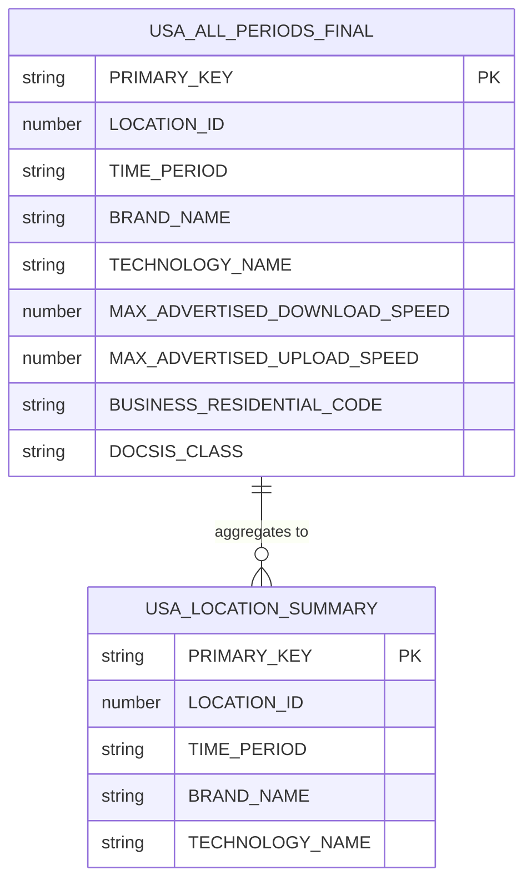
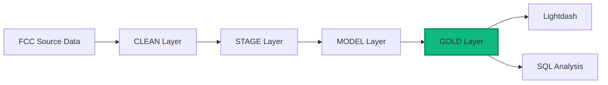

## Data Source

The Fiber Map dataset originates from the **Federal Communications Commission (FCC)** broadband availability reporting program, where internet service providers submit semi-annual reports detailing their service coverage across the United States.

### Dataset Size & Scope

- **Original Raw Data**: 5.2 billion records
- **Clean Layer**: 2.5 billion records (deduplicated and standardized)
- **Gold Layer (Current)**: 2% sample filtered to Indiana for optimized analysis
- **Geographic Coverage**: US-wide data collection, currently filtered to Indiana in analysis tables
- **Time Periods**: June 2022, December 2022, June 2023, December 2023, June 2024, December 2024

## Key Concepts

### Location ID - The Data Grain

The fundamental unit of analysis is the **`LOCATION_ID`**. Each location ID represents a unique broadband service location, typically corresponding to a building or serviceable address.

<Note>
One location can have multiple records because:
- Multiple providers may serve the same location
- A single provider may offer multiple technology types at one location
- Services are tracked across multiple time periods
- Business and residential services are recorded separately
</Note>

### Technology Codes

Services are classified by the technology used to deliver broadband:

| Code | Technology | Description |
|------|------------|-------------|
| 10 | Copper (DSL) | Traditional phone line-based internet |
| 40 | Cable | Cable TV infrastructure (DOCSIS) |
| 50 | Fiber to the Premises | Direct fiber optic connection |
| 60 | GSO Satellite | Geostationary orbit satellite |
| 61 | NGSO Satellite | Non-geostationary orbit satellite (e.g., Starlink) |
| 70 | Unlicensed Fixed Wireless | Unlicensed spectrum fixed wireless |
| 71 | Licensed Fixed Wireless | Licensed spectrum fixed wireless |
| 72 | LBR Fixed Wireless | Low-band radio fixed wireless |
| 0 | Other | Other technologies |

### Time Periods

Data is collected **semi-annually** in June and December. Each record is tagged with a time period in text format (e.g., "June 2023") and converted to a date (first day of the month: 2023-06-01).

### Business/Residential Classification

Services are tagged with availability codes:
- **B** = Business customers only
- **R** = Residential customers only  
- **X** = Both business and residential customers

## Table Overview

The Fiber Map Gold layer includes two primary tables optimized for different analysis needs:

### usa_all_periods_final

**Fully qualified name**: `FIBER_MAP.DBT_GOLD.USA_ALL_PERIODS_FINAL`

**Purpose**: Detailed location-level broadband availability data with full provider, technology, and speed information.

**Grain**: One row per combination of:
- Location ID
- Provider Brand + FRN
- Technology Type
- Time Period
- Business/Residential Code
- Advertised Speeds

**Best for**:
- Detailed provider analysis
- Speed tier analysis
- DOCSIS version tracking (cable providers)
- Build-out timeline analysis
- Census block-level geographic analysis

**Typical row count**: ~50 million records (Indiana 2% sample)

### usa_location_summary

**Fully qualified name**: `FIBER_MAP.DBT_GOLD.USA_LOCATION_SUMMARY`

**Purpose**: Aggregated summary providing a simplified view of location-level service availability.

**Grain**: One row per combination of:
- Time Period
- Provider Brand
- Technology Name
- Location ID

**Special feature**: Includes synthetic "All" technology rows to support Lightdash parameter filtering (allows users to view all technologies together).

**Best for**:
- Location counts and market share
- Provider footprint analysis
- Quick market sizing queries
- Lightdash dashboard filtering

**Typical row count**: ~5-10 million records (Indiana 2% sample)

## When to Use Which Table

<CardGroup cols={2}>
  <Card title="Use usa_all_periods_final when..." icon="magnifying-glass-chart">
    - You need speed information (download/upload Mbps)
    - You're analyzing DOCSIS versions for cable providers
    - You need business vs. residential breakouts
    - You want census block geographic detail
    - You're tracking service build dates
  </Card>
  
  <Card title="Use usa_location_summary when..." icon="chart-simple">
    - You only need location counts
    - You want faster query performance
    - You're building dashboards in Lightdash
    - You don't need speed or detailed attributes
    - You want simple provider market share analysis
  </Card>
</CardGroup>

## Table Relationships

The two Gold tables can be joined together, though in most cases you'll only need one or the other:

### Join Pattern

When joining these tables in Lightdash or SQL:
- Join on: `LOCATION_ID`, `TIME_PERIOD`, `BRAND_NAME`, and `TECHNOLOGY_NAME`
- Use LEFT JOIN to preserve all records
- Exclude synthetic rows where `TECHNOLOGY_NAME = 'All'` from `usa_location_summary`

<Warning>
When joining these tables, **exclude rows where `TECHNOLOGY_NAME = 'All'`** from `usa_location_summary`. These are synthetic rows added for Lightdash filtering and don't correspond to actual detail records.
</Warning>

## Data Architecture Layers

While business users typically work with the **GOLD layer**, understanding the full architecture helps explain data lineage:

### Layer Details

**CLEAN Layer** (`FIBER_MAP.CLEAN.*`)
- Raw FCC data, no transformations
- Source of truth
- Table: `USA_ALL_PERIODS_FINAL` (2.5B rows)

**STAGE Layer** (`FIBER_MAP.DBT_STAGE.*`)
- Standardized column names
- Proper data types
- Prefixed with `stg_`
- Not typically used by analysts

**MODEL Layer** (`FIBER_MAP.DBT_MODEL.*`)
- Normalized business entities
- Derived analytical fields
- Prefixed with `mdl_`
- Not typically used by analysts

**GOLD Layer** (`FIBER_MAP.DBT_GOLD.*`) ← **Start here!**
- Analysis-ready tables
- Optimized for business questions
- Denormalized with all necessary context
- Where analysts should focus

## Primary Keys

Both Gold tables include a `PRIMARY_KEY` field that uniquely identifies each row:

- **usa_all_periods_final**: MD5 hash of location + brand + time period + FRN + technology + business/residential code + speeds
- **usa_location_summary**: MD5 hash of time period + brand + technology + location

<Tip>
Primary keys are useful for joining tables and ensuring record uniqueness, but for most business analysis, you'll filter and group by the human-readable dimension fields instead.
</Tip>

## Next Steps

<CardGroup cols={2}>
  <Card title="Data Dictionary" icon="book" href="/fiber-map/data-dictionary/overview">
    Explore all available fields and their definitions
  </Card>
  
  <Card title="Key Metrics" icon="calculator" href="/fiber-map/key-metrics">
    Learn about core metrics like location counts
  </Card>
</CardGroup>

